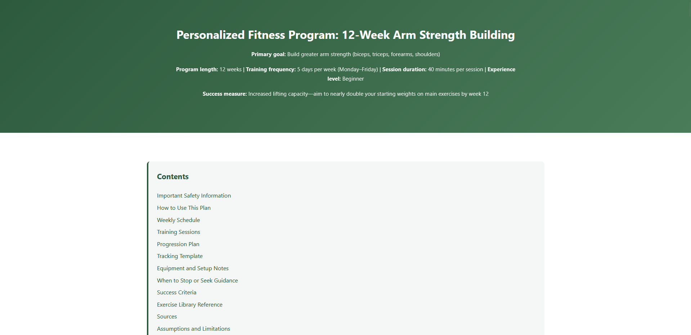
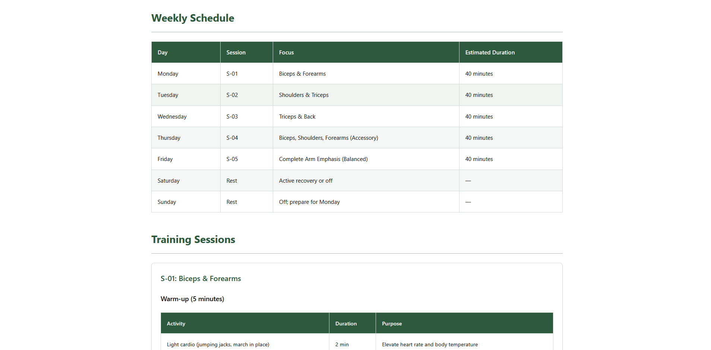
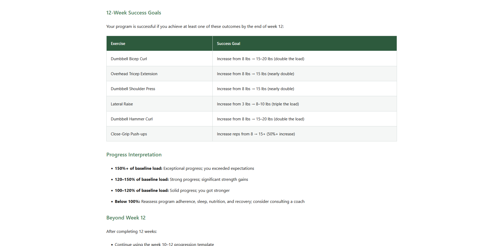

# Fitness Planner Agentic Workflow

A persisted Claude Code workflow that turns confirmed user requirements into a
sourced, validated, explicitly approved fitness program and a standalone HTML
guide.

The project demonstrates a model-driven hub-and-spoke architecture with dynamic
subagent selection, parallel research, reusable skills, quality gates, targeted
retries, MCP integration, deterministic approval, hooks, and resumable state.

> This project provides general fitness information, not diagnosis, treatment,
> or medical care. It does not replace guidance from a qualified professional.

## Example Output

The workflow produces a self-contained HTML fitness guide with a consistent,
responsive, and printable layout.

### Program overview and navigation



### Weekly schedule and training sessions



### Progress goals and interpretation



## Prerequisites

- Git
- Python 3.10 or newer, for the repository hooks
- [Claude Code](https://code.claude.com/docs/en/overview)
- [`uv`](https://docs.astral.sh/uv/getting-started/installation/), which provides
  `uvx` for launching the wger MCP server
- A wger API key for the included MCP configuration

The workflow uses Claude Code's built-in web search and fetch tools. Their
availability depends on the Claude Code account and environment used to run the
project.

## Setup

Clone the repository and enter its root directory:

```bash
git clone <repository-url>
cd fitness-agentic-workflow
```

Create the machine-local Claude settings file:

```bash
cp .claude/settings.local.json.example .claude/settings.local.json
```

Replace the example value in `.claude/settings.local.json` with your wger key:

```json
{
  "env": {
    "WGER_API_KEY": "your-real-key"
  },
  "enabledMcpjsonServers": [
    "wger"
  ]
}
```

`.claude/settings.local.json` is ignored by Git and merged with the committed
project settings. Do not put the key directly in `.mcp.json`,
`.claude/settings.json`, an artifact, or a committed shell script. The committed
example contains only a placeholder.

Launch Claude Code normally from the repository root:

```bash
claude
```

Start Claude Code from the repository root so it discovers `CLAUDE.md`, the
project command, agents, skills, hooks, settings, and `.mcp.json`. Accept the
project trust prompt after reviewing these files.

Inside Claude Code, run `/mcp` and verify that `wger` is connected. The project
exposes only the exercise and equipment MCP capabilities required by this
workflow.

## Start a Workflow

Provide the goal and as many known constraints as possible:

```text
/fitness-planner Build a 10-week arm hypertrophy program for an intermediate lifter. I can train three days per week for 60 minutes in a commercial gym. Use kilograms. I have no current pain or injuries.
```

For a shorter initial request, the requirements agent asks only the material
questions needed to proceed.

The first interactive gate asks you to confirm the complete requirements with
exactly:

```text
CONFIRM REQUIREMENTS
```

After confirmation, the coordinator continues through research, design,
progression, validation, and synthesis. It then shows the complete candidate and
asks for exactly:

```text
APPROVE FITNESS PLAN
```

Only this exact approval authorizes final HTML creation. Any other response is
treated as rejection or revision feedback, and affected work is regenerated and
validated before approval is requested again.

## Resume a Workflow

Every run stores its current state under `runs/<run-id>/`. After an interruption
or Claude Code restart, resume with:

```text
/fitness-planner resume <run-id>
```

For example:

```text
/fitness-planner resume 20261007-082207-arm-muscles
```

The coordinator verifies recorded artifacts, preserves valid completed work,
repairs legacy routing when possible, and continues from the earliest pending,
failed, or stale stage. It does not intentionally repeat valid completed stages.

Do not edit `workflow-state.json` manually while a run is active. To find a run
ID, list the directories under `runs/`.

## Execution Flow

```text
requirements-formalizer
  -> [exercise-researcher, equipment-planner, safety-researcher when required]
  -> program-designer
  -> progression-planner
  -> validator (pre-synthesis)
  -> plan-synthesizer
  -> validator (final candidate)
  -> human approval
  -> html-builder
```

The research agents run in parallel because they share only the confirmed
requirements. Dependent stages run sequentially. `safety-researcher` is selected
only when disclosed constraints make it applicable.

The coordinator itself does not produce fitness recommendations. Each subagent
owns exactly one artifact, and downstream work is blocked until required inputs
are complete and valid.

## Components

| Component | Responsibility |
| --- | --- |
| `/fitness-planner` | Creates or resumes runs, selects agents, manages state, retries, and approval |
| `requirements-formalizer` | Captures and confirms the user contract |
| `exercise-researcher` | Researches sourced exercise candidates using web sources |
| `equipment-planner` | Verifies equipment and substitutions using wger MCP |
| `safety-researcher` | Researches applicable precautions when safety constraints exist |
| `program-designer` | Builds the weekly sessions |
| `progression-planner` | Defines progression, regression, deload, and tracking rules |
| `validator` | Applies named structural and fitness-domain quality gates |
| `plan-synthesizer` | Produces the coherent candidate shown for approval |
| `html-builder` | Renders the approved candidate without changing its meaning |

### Reusable skills

- `artifact-validator` checks artifact structure, ownership, status, references,
  tables, placeholders, and citations before dependent execution.
- `fitness-html-theme-builder` supplies the semantic, accessible, responsive,
  and printable HTML rendering contract.

### Hooks

- `artifact-owner-guard` prevents the coordinator or another subagent from
  writing an artifact owned by a different agent.
- `state-integrity-guard` rejects malformed state, duplicate JSON keys, removed
  artifact entries, and discarded hash metadata.
- `approval-gate-guard` blocks writes to `fitness-plan.html` until the current
  candidate has complete named final-gate results plus matching validation and
  approval SHA-256 values.
- `no-leak-guard` blocks internal artifact filenames and run paths from the
  candidate and final HTML.
- `post-write-state` merges successful artifact writes into
  `workflow-state.json` using locking and atomic replacement.

## Run Artifacts

A complete run can contain:

```text
runs/<run-id>/
├── input.md
├── requirements.md
├── execution-plan.md
├── exercise-research.md
├── equipment-plan.md
├── safety-research.md        # only when selected
├── program-draft.md
├── progression-plan.md
├── validation.md
├── approved-candidate.md
├── approval.md
├── fitness-plan.html
└── workflow-state.json
```

`workflow-state.json` records orchestration status, selected agents, artifact
attempts, validation results, approval, timestamps, and the next executable
stage. The final user deliverable is `fitness-plan.html`; the Markdown files are
workflow evidence and recovery data.

## Validation and Retries

The workflow checks structure, citations, requirements coverage, equipment,
schedule feasibility, safety constraints, session completeness, progression,
source traceability, and candidate coherence.

When a gate fails, the validator identifies the earliest owning agent. The
coordinator reruns only that agent and the downstream artifacts made stale by
its change. Independent valid work is preserved. Each affected artifact has a
maximum of three quality-gate attempts; unresolved failures stop dependent work
and remain recorded in the run state and validation report.

## Cost-Conscious Defaults

Subagents use the `haiku` model and project settings request low effort with
extended thinking disabled. Tool-heavy artifact agents allow four turns so they
can write and read back their output instead of returning a false completion at
the former three-turn boundary. These choices reduce usage but are not a
guaranteed token or cost limit. Parallel agents still make separate model calls,
and web or MCP operations may add latency. Review `.claude/settings.json` and
the agent frontmatter before running the demonstration with a paid account.

## Reviewer Walkthrough

1. Review `CLAUDE.md` and `.claude/commands/fitness-planner.md`.
2. Confirm at least five agents are selected in `execution-plan.md` for a normal
   run.
3. Inspect research artifacts for web URLs and `equipment-plan.md` for recorded
   wger tool calls and IDs.
4. Inspect `validation.md` for named gates, findings, retry routing, and retained
   validation history.
5. Verify that HTML cannot be written before exact approval.
6. Interrupt and resume a run to verify that completed valid work is preserved.
7. Open `fitness-plan.html` locally and test narrow-screen and print layouts.

The assignment expects at least three representative sample run directories to
be committed, including their inputs, artifacts, and state. Before publishing,
remove secrets and inspect every sample artifact for accidental personal data.

## Troubleshooting

### `/fitness-planner` is not listed

Start Claude Code from the repository root. If the session was already running
when the command or its directory was first created, restart Claude Code.

### wger is disconnected or the equipment stage is blocked

Confirm that `uvx` is installed, `.claude/settings.local.json` contains a real
`WGER_API_KEY`, and `/mcp` reports the `wger` server as connected. Restart Claude
Code after changing local settings.

### A final HTML write is denied

This is expected until final-candidate validation passes and the current
candidate is approved. If the candidate changed after approval, it must be
validated and approved again because its SHA-256 no longer matches.

### A run stopped after three attempts

Read the latest findings in the run's validation report. The coordinator does
not bypass retry exhaustion. Correct the underlying requirement, integration,
or agent contract, then start or deliberately repair the run rather than marking
it complete manually.

### A hook reports a state-update failure

Ensure Python 3 is available and `workflow-state.json` contains valid JSON. The
artifact write may have succeeded even when the state merge failed, so resume
the run and let the coordinator reconcile the artifact before continuing.

## Repository Layout

```text
.claude/
├── agents/                 # Specialized subagents
├── commands/               # /fitness-planner coordinator
├── skills/                 # Reusable validation and rendering rules
└── settings.json           # Permissions, sandbox, environment, and hooks
hooks/                      # Deterministic Python hook implementations
runs/                       # Persisted and sample workflow runs
.claude/settings.local.json.example # Local MCP environment template
.mcp.json                   # Project-scoped wger MCP configuration
CLAUDE.md                   # Workflow-wide contract
README.md                   # Setup and operating guide
```
